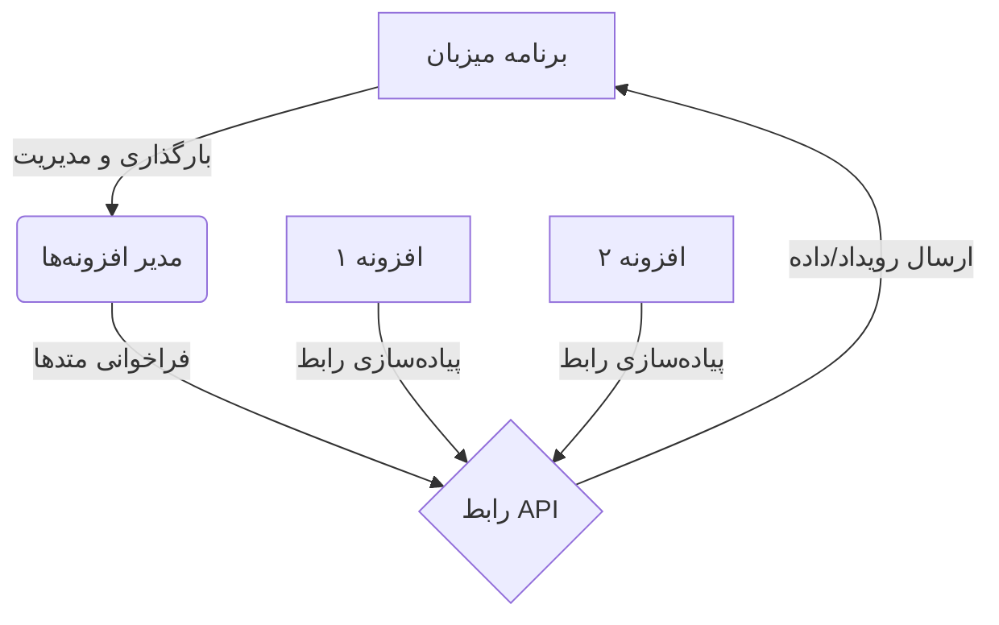

# مستند طراحی سیستم افزونه‌ها (Plugin System Design Document)

## ۱. مقدمه
این سند به منظور طراحی و پیاده‌سازی یک سیستم افزونه‌ای (Plugin System) تهیه شده است که به برنامه‌های شخص ثالث اجازه می‌دهد تا به عنوان ماژول‌های اضافی به برنامه اصلی متصل شوند، با آن ارتباط برقرار کنند و قابلیت‌های جدیدی را بدون نیاز به تغییر در کد هسته اصلی برنامه فراهم آورند.

---

## ۲. اهداف سیستم
- **قابلیت گسترش:** امکان افزودن قابلیت‌های جدید بدون تغییر در کد منبع اصلی.
- **جداسازی:** جداسازی کامل کد افزونه از هسته اصلی برای جلوگیری از تداخل و افزایش پایداری.
- **امنیت:** کنترل دسترسی افزونه‌ها به منابع سیستم و داده‌های حساس.
- **استانداردسازی:** تعریف پروتکل‌ها و رابط‌های استاندارد برای توسعه‌دهندگان افزونه.

---

## ۳. معماری کلی سیستم

سیستم از سه بخش اصلی تشکیل شده است:

1.  **برنامه میزبان (Host Application):** برنامه اصلی که هسته مرکزی را اجرا کرده و مدیریت افزونه‌ها را بر عهده دارد.
2.  **رابط برنامه‌نویسی افزونه (Plugin API):** مجموعه‌ای از توابع، رویدادها و ساختارهای داده‌ای که نحوه تعامل افزونه با میزبان را تعریف می‌کند.
3.  **افزونه (Plugin):** ماژول مستقل (کتابخانه داینامیک، سرویس وب، یا اسکریپت) که منطق خاصی را پیاده‌سازی کرده و از طریق API با میزبان ارتباط برقرار می‌کند.



---

## ۴. مکانیزم‌های ارتباطی

بسته به نیاز و زبان برنامه‌نویسی، می‌توان از یکی از روش‌های زیر برای ارتباط استفاده کرد:

### ۴-۱. کتابخانه‌های اشتراک‌گذاری شده (Shared Libraries) - *پیشنهاد برای عملکرد بالا*
در این روش، افزونه‌ها به صورت فایل‌های باینری (مانند `.dll` در ویندوز، `.so` در لینوکس، یا `.dylib` در مک) کامپایل می‌شوند.
- **مزایا:** سرعت اجرای بسیار بالا، دسترسی مستقیم به حافظه (با احتیاط).
- **معایب:** وابستگی به زبان و پلتفرم خاص، خطر کرش کردن برنامه اصلی در صورت خطا در افزونه.
- **نحوه کار:** میزبان با استفاده از مکانیزم‌هایی مثل `dlopen` (در لینوکس) یا `LoadLibrary` (در ویندوز) افزونه را بارگذاری کرده و توابع صادراتی آن را فراخوانی می‌کند.

### ۴-۲. ارتباط بین فرآیندی (IPC) - *پیشنهاد برای پایداری و امنیت*
افزونه‌ها به عنوان فرآیندهای جداگانه اجرا می‌شوند و از طریق سوکت‌ها (TCP/Unix Domain Sockets)، لوله‌ها (Pipes) یا صف‌های پیامی با میزبان ارتباط برقرار می‌کنند.
- **مزایا:** ایزولاسیون کامل (کرش افزونه تاثیری روی میزبان ندارد)، امنیت بالاتر، استقلال زبانی (افزونه می‌تواند با هر زبانی نوشته شود).
- **معایب:** سربار ارتباطی (Overhead)، پیچیدگی بیشتر در پیاده‌سازی.
- **پروتکل پیشنهادی:** JSON-RPC یا gRPC بر روی Unix Domain Socket برای ارتباطات محلی سریع و امن.

### ۴-۳. ماشین‌های مجازی یا مفسرها (Scripting Engines)
استفاده از زبان‌های اسکریپتی مانند Lua، Python یا JavaScript که درون یک ماشین مجازی تعبیه شده (Embedded) در برنامه اصلی اجرا می‌شوند.
- **مزایا:** انعطاف‌پذیری بالا، عدم نیاز به کامپایل مجدد، امنیت نسبی از طریق محدودسازی دسترسی‌ها.
- **معایب:** سرعت کمتر نسبت به کد باینری خالص.

---

## ۵. چرخه حیات یک افزونه (Lifecycle)

هر افزونه باید مراحل زیر را طی کند:

1.  **کشف (Discovery):** میزبان پوشه مشخصی (مثلاً `./plugins`) را اسکن کرده و فایل‌های معتبر افزونه را شناسایی می‌کند.
2.  **بارگذاری (Loading):** میزبان افزونه را بارگذاری کرده (یا فرآیند آن را اجرا می‌کند) و متد اولیه‌سازی را فراخوانی می‌کند.
3.  **ثبت نام (Registration):** افزونه اطلاعات خود (نام، نسخه، قابلیت‌ها) و لیست "Hook"ها یا دستوراتی که پشتیبانی می‌کند را به میزبان اعلام می‌کند.
4.  **اجرا (Execution):** در طول运行 برنامه، میزبان بر اساس رویدادها یا درخواست‌های کاربر، توابع مربوطه در افزونه را فراخوانی می‌کند.
5.  **توقف (Shutdown):** هنگام بسته شدن برنامه یا غیرفعال‌سازی افزونه، میزبان متد تمیزکاری (Cleanup) را فراخوانی می‌کند تا منابع آزاد شوند.

---

## ۶. تعریف رابط برنامه‌نویسی (API Specification)

برای استانداردسازی، هر افزونه باید یک کلاس یا ساختار مشخص را پیاده‌سازی کند. نمونه‌ای از یک رابط فرضی به صورت شبه‌کد (Pseudo-code):

```typescript
// تعریف رابط در برنامه میزبان
interface IPlugin {
    // اطلاعات هویتی
    getManifest(): PluginManifest;

    // متدهای چرخه حیات
    onInitialize(context: HostContext): Promise<void>;
    onShutdown(): Promise<void>;

    // نقطه ورود برای پردازش داده‌ها یا رویدادها
    handleEvent(eventType: string, payload: any): Promise<any>;
}

interface PluginManifest {
    name: string;
    version: string;
    author: string;
    description: string;
    requiredPermissions: string[]; // مثلاً: ["read_file", "network_access"]
}
```

### داده‌های مبادله‌ای
تمامی داده‌های مبادله‌ای بین میزبان و افزونه باید به صورت سریال‌شده (ترجیحاً JSON) و دارای ساختار مشخص باشند:
- **درخواست:** `{ "id": "uuid", "method": "plugin.methodName", "params": {...} }`
- **پاسخ:** `{ "id": "uuid", "result": {...}, "error": null }`

---

## ۷. امنیت و مجوزها

برای جلوگیری از سوءاستفاده، سیستم باید دارای لایه‌های امنیتی زیر باشد:
- **ساندباکس (Sandboxing):** محدود کردن دسترسی افزونه به فایل‌سیستم، شبکه و حافظه فقط به مواردی که در `Manifest` درخواست و توسط کاربر تایید شده است.
- **امضای دیجیتال:** بررسی امضای دیجیتال افزونه‌ها قبل از بارگذاری برای اطمینان از منبع موثق.
- **مدیریت خطا:** تمام فراخوانی‌های افزونه باید در بلوک‌های `try-catch` قرار گیرند تا خطای یک افزونه کل برنامه را متوقف نکند.

---

## ۸. راهنمای توسعه‌دهنده افزونه

برای ساخت یک افزونه جدید، توسعه‌دهنده باید مراحل زیر را طی کند:

1.  **نصب SDK:** دانلود کتابخانه کمکی یا الگوی پروژه (Template) از مخزن رسمی.
2.  **پیاده‌سازی رابط:** ایجاد کلاسی که اینترفیس `IPlugin` را پیاده‌سازی می‌کند.
3.  **تعریف Manifest:** تکمیل فایل پیکربندی (مثلاً `plugin.json`) شامل نام و مجوزهای مورد نیاز.
4.  **تست:** اجرای افزونه در محیط تست میزبان (Host) برای اطمینان از عملکرد صحیح.
5.  **بسته‌بندی:** خروجی گرفتن نهایی (فایل باینری یا پوشه اسکریپت) و قرار دادن آن در پوشه `plugins`.

### نمونه کد ساده (به زبان پایتون - فرض بر ارتباط IPC)

```python
import json
import sys

class MyPlugin:
    def get_manifest(self):
        return {
            "name": "SamplePlugin",
            "version": "1.0.0",
            "permissions": ["log_message"]
        }

    def handle_event(self, event_type, payload):
        if event_type == "user_login":
            username = payload.get("username")
            print(f"[Plugin] User {username} logged in.")
            return {"status": "logged"}
        return None

if __name__ == "__main__":
    # حلقه اصلی خواندن دستورات از stdin (ارتباط با میزبان)
    plugin = MyPlugin()
    for line in sys.stdin:
        request = json.loads(line)
        method = request.get("method")
        
        response = {}
        if method == "get_manifest":
            response["result"] = plugin.get_manifest()
        elif method == "handle_event":
            args = request.get("params")
            response["result"] = plugin.handle_event(args["type"], args["data"])
            
        # ارسال پاسخ به stdout
        print(json.dumps(response), flush=True)
```

---

## ۹. نتیجه‌گیری
این سند چارچوب کلی برای ایجاد یک سیستم افزونه‌ای منعطف و امن را فراهم می‌کند. با پیروی از این استانداردها، توسعه‌دهندگان شخص ثالث می‌توانند به راحتی قابلیت‌های جدیدی را به برنامه اضافه کنند و اکوسیستم نرم‌افزار را گسترش دهند. گام بعدی، پیاده‌سازی هسته مدیریت افزونه‌ها در برنامه اصلی بر اساس پروتکل انتخابی (IPC یا Shared Library) است.
